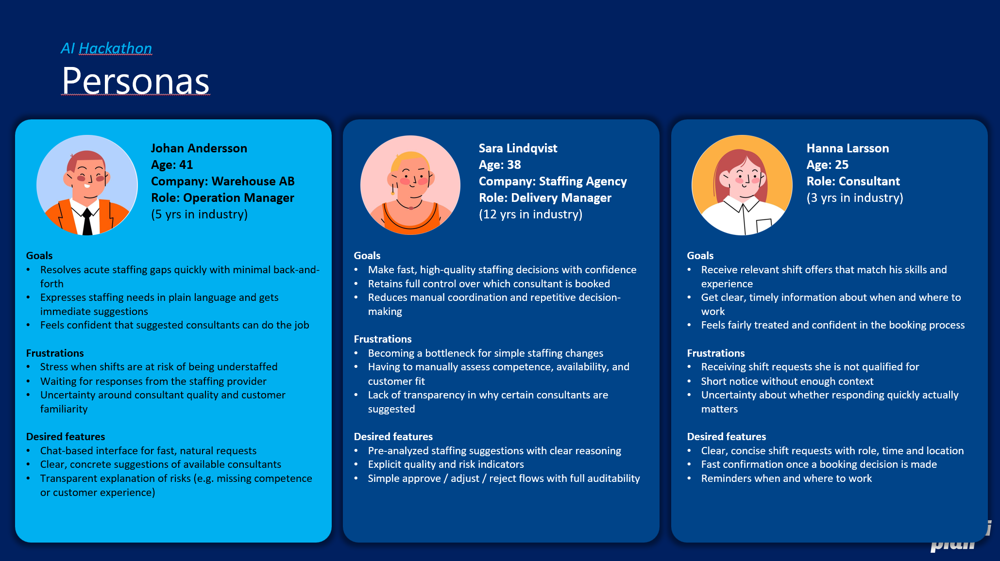
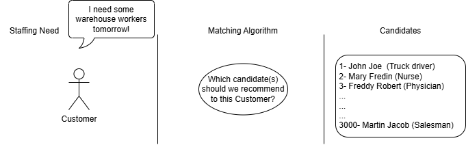
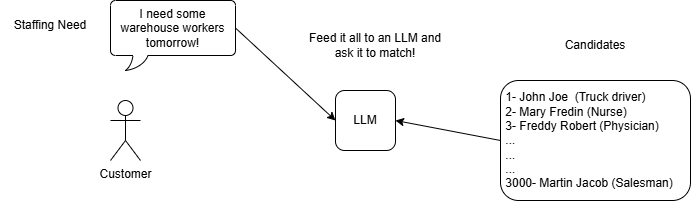
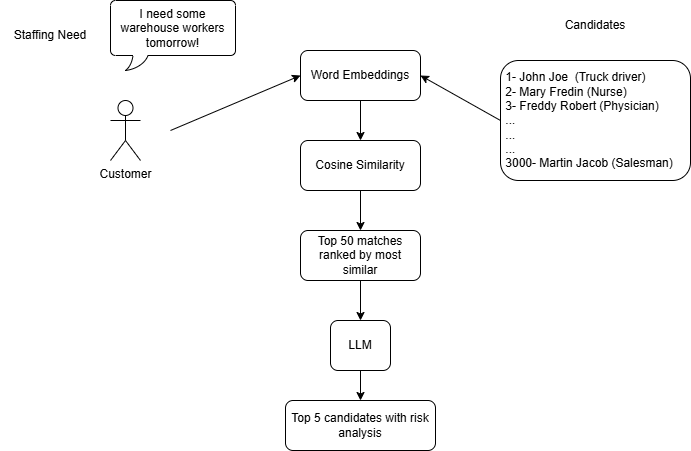

# Intelliplan AI Staffing Assistant

Top 5 Finalist – Kolomolo AI Business Value 2026 Hackathon (AWS Stockholm)

---

## Agenda

1. Introduction & Problem Definition
2. Technical Problem & Proposed Approach
3. Results
4. Prerequisites
5. How to Run
6. Architecture Overview
7. Credits & Licensing

---

# 1. Introduction & Problem Definition

## What is Staffing?

Staffing is the process of matching companies that need temporary workers with qualified candidates.

Example:  
A warehouse experiences a sudden spike in deliveries and urgently needs two forklift-certified workers for the next morning shift. Instead of hiring permanently, they submit a staffing request. A staffing agency then matches available consultants who meet the required qualifications and schedule.

---

## What is Intelliplan?

Intelliplan is a digital staffing platform that facilitates this process. It connects:

- Customers (companies requesting staff)
- Consultants (available candidates)
- Delivery Managers (who oversee and approve final matches)

The goal is to streamline staffing by making it faster, smarter, and scalable.

---

## Personas

- Johan – Customer submitting staffing requests
- Hanna – Consultant available for work
- Sara – Delivery Manager with final approval authority

---

## The Business Problem

Intelliplan wanted customers to:

- Interact with a chatbot
- Describe staffing needs in natural language
- Receive immediate candidate recommendations
- Initiate communication with suggested consultants

However:

- The Delivery Manager must have final approval.
- Candidate matching must scale up to 3000+ profiles.
- Matching must be accurate, cost-efficient, and fast.

Our task was to build an AI-powered chat experience with a powerful matching system that connects natural language staffing requests to natural language candidate profiles.

---

# 2. Technical Problem & Proposed Approach

## The Technical Challenge

On one side:

- A staffing request written in natural language
- Includes competences, date, time, urgency, etc.

On the other side:

- A candidate pool that can reach 3000+ profiles
- Each profile contains competences, experience, availability, etc.

Efficient matching at scale is crucial.

---

## Brainstormed Approaches

### Approach #1 – Pure LLM Matching

Feed all candidate profiles + staffing request into a Large Language Model and let it match.

Pros:

- Strong reasoning
- Excellent risk assessment
- Human-like explanations

Cons:

- Expensive at scale
- Slow with large candidate pools
- Token limits become problematic
- 3000 candidates ≈ 15,000+ lines of text per request

Not scalable.

---

### Approach #2 – Semantic Matching (Embeddings + Similarity)

Use pretrained embedding models to:

1. Convert text into vector representations
2. Compute similarity scores (Cosine similarity, L1, L2 distance)
3. Select top matches

Pros:

- Very fast
- Cheap
- Scalable
- Can run locally
- Works efficiently with thousands of candidates

Cons:

- Limited reasoning
- No deep risk assessment
- Less robust explanations

---

## Proposed Hybrid Approach

Why not combine both?

Step 1 – Semantic Filtering  
Reduce 3000 candidates → Top 50 relevant candidates using embeddings.

Step 2 – LLM Refinement  
Pass:

- Staffing request
- Top 50 candidates

To an LLM for:

- Final ranking
- Risk assessment
- Explanations

Advantages:

- Fast
- Scalable
- Cost-efficient
- Strong reasoning
- Excellent risk evaluation
- Balances performance and cost

Disadvantages:

- None identified within hackathon scope

---

# 3. Results

- Built a scalable hybrid AI architecture in ~24 hours
- Delivered measurable business value aligned with Intelliplan’s needs
- Ranked among the Top 5 teams in the Kolomolo AI Business Value 2026 Hackathon (AWS Stockholm)

---

# 4. Prerequisites

Make sure you have:

- Anaconda installed
- Node.js installed

---

# 5. How to Run

## 1. Environment Variables

Create `.env` files for both:

- /backend
- /frontend

Use `.env.example` as reference.

---

## 2. Backend Setup

Navigate to /backend:

`conda env create -f environment.yml`

`conda activate mena_3_10`

Run backend:

uvicorn intelliplanApi.main:app

Optional tests:

`pytest -s`

---

## 3. Frontend Setup

Navigate to /frontend:

`npm install`

`npm run dev`

Everything should now be running locally.

---

# 6. Architecture Overview

Backend:

- FastAPI
- Embedding-based semantic filtering
- LLM-based ranking and risk assessment
- Hybrid AI matching pipeline

Frontend:

- React / Next.js
- Chat interface
- Candidate presentation
- Role-based dashboards (Customer, Consultant, Manager)

---

# 7. Credits & Licensing

## Idea Ownership

The project idea and business concept were provided by Intelliplan.  
All intellectual property rights related to the original concept remain with Intelliplan.

---

## Backend & AI Development

Developed by:

Mena Saleh  
mena.a.saleh.2001@gmail.com

Includes:

- Hybrid matching algorithm
- Semantic similarity pipeline
- LLM risk assessment framework
- Backend API architecture

---

## Frontend & UI/UX

Developed collaboratively by the team.  
Design language and visual inspiration are derived from Intelliplan’s design system.

---

## Licensing

This repository is provided for demonstration and educational purposes. We do not own the business idea or the design system, just the technical implementation.
